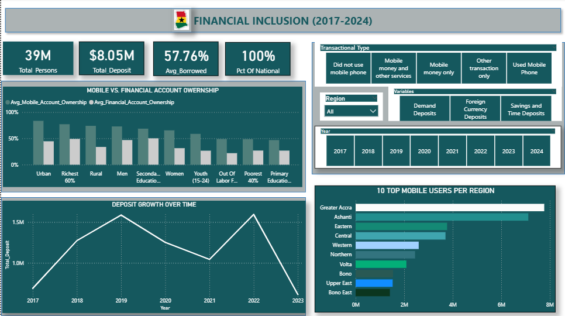

# Ghana_Financial_Inclusion(2017-2024)

# Project Overview

This project analyzes the evolution of financial inclusion in Ghana between 2017 and 2024. The analysis integrates mobile money usage data, money supply and deposit data, and regional demographic indicators to evaluate access, usage patterns, deposit stability, and borrowing growth.

# Project Context

This project was completed as part of a group assignment. I took ownership of the technical execution and was responsible for the end-to-end data analysis process.

# My Role

* Sourced and prepared datasets from multiple sources
* Cleaned and transformed data using Excel
* Designed a structured database using SQL
* Connected the database to Power BI for analysis
* Built interactive dashboards to present key insights

# To assess how financial inclusion is progressing in Ghana, dataset  retrieved include :

* Global Findex Database (Mobile money) dataset:
Captured ownership and usage rates across regions.

* Monthly Monetary Survey(Money supply) dataset:
Tracked deposit levels, liquidity patterns, and circulation of funds.

* Regional and demographic dataset, (Interest dataset):
Linked inclusion indicators to specific regions and demographic groups.
Total population of 39M was derived by summing age brackets from this table to serve as the population base.

# Project Objective

The analysis aimed to:

* Examine how financial inclusion evolved in Ghana from 2017 to 2024.
* Analyze deposit trends and mobile money usage patterns.
* Explore the relationship between interest rates, deposit behavior, and mobile money adoption.
* Identify financially underserved regions and explain structural gaps.
* Develop data driven recommendations to improve banking access and increase deposit mobilization.

# Key Insights
 
* Mobile money adoption increased financial inclusion, but usage remains concentrated in limited transaction types.
* Demand deposits account for 37.5 percent of total deposits, while foreign currency deposits represent 29.4 percent, showing     exposure to currency risk.
* Deposits increased from 2017 to 2019, declined in 2020 and 2021, recovered in 2022, and dropped sharply in 2023.
* Financial inclusion remains lower in regions such as Oti and Savannah compared to Greater Accra and Ashanti.
* Borrowing activity shows gradual growth but varies across years and regions.

# Business Question

Which factors drive financial inclusion in Ghana, and how do mobile money, deposits, and demographics influence access between 2017 and 2024?

Data Workflow and Tools Used

Data Sources

* Global Findex Database for mobile money ownership and usage.
* Bank of Ghana Monetary Survey for deposit and liquidity data.
* Ghana Statistical Service for demographic indicators.

# Excel

* Cleaned and prepared raw datasets.
* Handled missing values and standardized formats.
* Structured data for database integration.

# SQL (MySQL)

* Built a relational database from multiple data sources.
* Performed joins to combine financial and demographic datasets.
* Aggregated data for analysis.

# Python (Jupyter Notebook in VS Code)

* Data cleaning
* Connected directly to SQL database.
* Queried structured data for analysis.
* Performed trend analysis and validation.

# Power BI

* Connected directly to MySQL database for data access and analysis.
* Cleaned and transformed data using Power Query.
* Handled missing values and standardized data formats.
* Unpivoted monthly columns into a single “Month” column with corresponding values for proper time series analysis.
* Created a dimensional data model by separating fact and dimension tables.
* Established relationships between tables to support accurate filtering and aggregation.
* Built 7 DAX measures using functions such as CALCULATE, SUM, AVERAGE, and DISTINCTCOUNT to compute key metrics.
* Developed an interactive dashboard to analyze financial inclusion trends, deposit patterns, and regional disparities.
* Enabled filtering by region, year, gender, and income group for deeper analysis.

## Dashboard

This dashboard shows trends in financial inclusion, deposit growth, and regional disparities across Ghana.

Methodology

* Population Base Definition
Established a consistent base of 39M individuals using the demographic dataset.

* Transaction Segmentation
Classified individuals into digital transaction categories to measure depth of financial engagement.

* Deposit Structure Analysis
Measured composition of demand, savings and time, and foreign currency deposits to assess system stability.

* Trend Evaluation
Examined deposit trends from 2017 to 2023 and borrowing patterns from selected years between 2017 and 2024.

* Regional Assessment
Compared mobile money usage and inclusion indicators across regions to identify underserved areas.

# Key Insights
1.Digital access is expanding but concentrated
Mobile money drives inclusion, but usage remains concentrated in single channel behavior.

2.Deposit structure is transactionlly dominated
Demand deposits represent 37.5 percent of total deposits while Foreign currency deposits account for 29.4 percent, indicating exposure to currency risk.

3.Deposits are vulnerable to macroeconomic shocks
Deposits increased from 2017 to 2019, declined in 2020 and 2021, recovered in 2022, and dropped sharply in 2023 amomg all three varibles hence the need for further research.

4.Foreign currency deposits represent nearly one third of total deposits, signaling currency risk concerns.

5.Borrowing is accelerating
Average borrowing increased by 85.8 percent between 2017 and 2024, indicating rising reliance on credit.

6.Some regions show significantly lower digital financial engagement, indicating geographic inequality in access.

Data Limitation

* Financial inclusion data spans 2017 to 2024.
* Deposit data spans 2017 to 2023.
* Average borrowing data is available only for selected years, 2017, 2021, and 2024.

NB:Because deposit data is unavailable for 2024 and borrowing years are discontinuous, full year by year comparison between credit growth and deposit expansion is constrained.

# RECOMMENDATION

1. Expand Financial Infrastructure in Underserved Regions
Establish additional banking outlets and mobile money agent networks in regions such as Oti and Savannah to reduce geographic inequality.

2.Promote Digital Financial Literacy
Implement targeted financial education programs for rural communities, youth, and low-income groups to improve responsible usage of digital financial services.

3.Encourage Sustainable Savings Growth
Develop interest-based savings products, micro-savings tools, and incentive-based programs to maintain deposit stability.

4.Strengthen Monitoring of Borrowing Trends
Closely monitor rising borrowing patterns to mitigate potential liquidity stress and reduce long-term default risks.

## Project Structure

ghana-financial-inclusion-2017-2024/
│
├── data/ 
│   ├── raw/         # Original datasets from BoG, GSS, and World Bank in CSV and Excel format.
│   ├── cleaned/     # cleaned: Processed datasets with missing values handled and variables standardized.
│
├── mysql           # Database creation and structured storage of multiple datasets.
                    # SQL queries for data extraction, joins, and aggregation.
                    
├── notebooks/      # Jupyter notebooks in Python for data cleaning, querying  and performing trend analysis.
├── Power BI/       # Power BI files for data transformation, modeling, and dashboard development.
│   
└── README.md       # Project documentation including methodology, insights, and recommendations.

